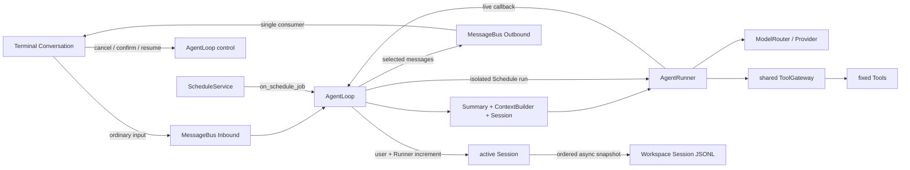
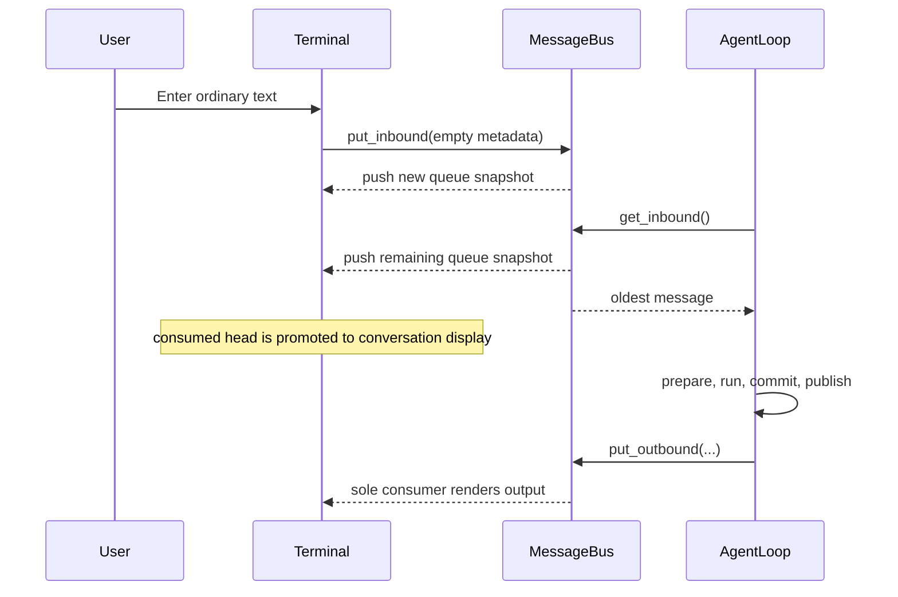
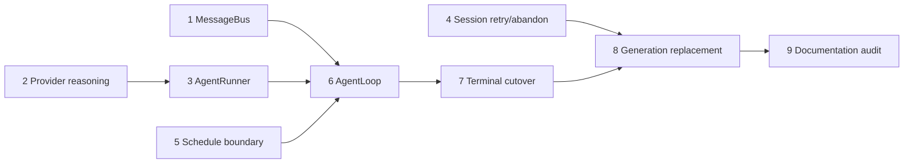

# Agent Message Bus and Runtime Refactoring Plan

Status: historical migration plan; Issues #163–#172 implemented the target architecture and
Issue #173 records the release-ready current state below.

This document retains the migration baseline and target-architecture record. References
to legacy transport names below describe the pre-#171 comparison or deletion plan;
the normative current contracts are in `docs/myclaw-runtime-contracts.md` and
`CONTEXT.md`.

## Current final state (#173)

The plan below is retained for migration traceability. The active implementation and
release evidence use these final facts:

- Foreground production has one path: Terminal Conversation -> one Agent Loop -> one
  Agent Runner, with one Agent Loop-owned Message Bus. Message Bus exposes exactly
  `inbound_snapshot`, `put_inbound`, `get_inbound`, `drain_inbound`, `put_outbound`, and
  `get_outbound`; Inbound mutations call one synchronous callback after releasing queue
  coordination. Outbound is an unbounded FIFO with one Terminal consumer and only
  `model_reasoning`, `model_response`, `tool_call`, and `system_control` messages.
  Message Bus has no independent close, abort, replay, broadcast, version, or
  backpressure lifecycle.
- The sparse markers are mutually exclusive `_stream_delta`, `_stream_end`, and
  `_streamed`. Tool calls carry the complete raw argument text; Tool results, Schedule
  output, and Memory Task output never enter Outbound.
- Agent Runner owns only Model Router, returns only its assistant/Tool increment, final
  content, four-field usage, finish reason, and optional `ErrorInfo`, and treats one
  model call plus all sequential Tool calls as one iteration. Provider retries do not
  consume iterations. `runtime.max_iterations` defaults to and cannot be below `50`;
  iteration 50 finishes all Tools and, unless normal cancellation has been requested,
  returns the fixed `agent_iteration_limit` result without call 51. Cancellation takes
  priority. Provider-visible reasoning is distinct from ordinary text; opaque
  continuation stays inside the same Tool loop and never enters Session or Outbound.
- Schedule Service is the only Store/management owner. It is created before Agent Loop;
  Agent Loop creates the fixed catalog, one shared Gateway and one Runner, then binds
  `on_schedule_job(job) -> None`. Foreground and Schedule share Gateway/Runner identity
  but isolate Session, context, cancellation, and externalizer state. Schedule has no
  confirmation channel or foreground Message Bus projection, uses `confirmation=None`,
  and resets its recursive-add ContextVar token in `finally`; the Schedule Artifact root
  and three-field reference shape are unchanged.
- Ordinary Session snapshots are ordered complete replacements with at most three async
  attempts and `100 ms`/`200 ms` backoff. Normal awaited close performs its bounded final
  save; `Session.abandon()` is synchronous, idempotent, cancels pending snapshots, and
  performs no final save. `PreparedRuntime.close()` is normal awaited shutdown while
  `PreparedRuntime.abort()` is forced synchronous replacement. RuntimeHost validates the
  target before abort/rebind/start; detached Provider cleanup is best effort and the
  accepted loss/at-least-once tradeoffs are documented in the current contracts.

Legacy names in the historical sections are quoted only to identify what was removed by
#171. They do not describe active classes, imports, exports, or runtime paths.

## 1. Objective

Refactor the foreground Agent path into two explicit layers:

- `AgentLoop`: long-lived product orchestration, active Session ownership, context and
  summary preparation, fixed Tool construction, persistence, recovery, controls, and
  Message Bus publication.
- `AgentRunner`: reusable, Session-independent, bounded ReAct execution.

At the same time, replace `ConversationPort` and `AgentEvent` transport with one
`MessageBus` per Agent Loop, keep the terminal input editable while a run is active,
isolate Schedule execution from foreground output, and make successful Session switches
replace the entire Session-bound Runtime Generation.

## 2. Historical pre-#163 code facts and impact baseline

The original implementation plan was based on the repository before the migration,
not on the current source tree:

- `myclaw/agent/runtime.py` historically owned `PreparedReplRuntime`, composition, lifecycle, Session,
  schedulers, router shutdown, and the deferred/switchable Conversation Port.
- `myclaw/agent/run.py` historically contained the unbounded `while True` model-and-Tool loop,
  cancellation repair, Tool execution, and Agent Run payload emission.
- `myclaw/agent/events.py` historically defined `AgentEvent`, its payload family, emitters, and
  `ConversationPort`; CodeGraph reports five production/test call sites for the port.
- The pre-migration CodeGraph report counted nineteen `AgentRun` call sites and eight `PreparedReplRuntime` call
  sites. The affected tests span agent, terminal, schedule, memory, Session, and runtime
  shutdown suites.
- The pre-migration `Session.persist()` chained complete snapshots in order but made one
  silent asynchronous write attempt; the current contract adds three-attempt retry.
- Schedule historically had its own service/store boundary and reused the Agent path, but
  the new composition must make the Service the only Store owner and bind execution
  through a callback after Agent Loop construction.
- Tool Artifact persistence already uses the Session ID. The existing path and
  `ArtifactReference` shape do not need a schema migration.
- Terminal Conversation and the headless REPL tests historically consumed the Conversation
  Port and Agent Events, so transport deletion must be one deliberate cutover rather
  than a partial rename.

Primary blast radius:

| Area | Required change | Compatibility expectation |
| --- | --- | --- |
| Agent contracts | Add bus messages, Runner result/events, controls | Session JSONL shape remains valid |
| Runtime composition | Replace `PreparedReplRuntime` with a generation owner | CLI startup and normal close remain single-owner |
| Provider seam | Surface returned reasoning and preserve opaque continuation state | Existing text/tool completion remains unchanged |
| Tool execution | Publish call name/raw arguments before execution | Tool results remain available to model and Session only |
| Schedule | Service callback, shared Gateway, recursion guard | Existing jobs/store format and Artifact path stay unchanged |
| Terminal | Direct bus consumption, queue UI, confirmation replacement | Existing Management Commands and conversation projection remain |
| Session | Async retry and force-abandon operation | JSONL format, atomic replacement, and normal close remain |
| Configuration | Add `runtime.max_iterations` | Existing config without the key resolves to 50 |

## 3. Scope boundaries

### In scope

- Ordinary-user-message FIFO input and terminal queue editing.
- Selected live foreground output: Provider-visible reasoning, model response, Tool call,
  and terminal control result.
- A bounded ReAct Runner with stable completion and repair semantics.
- Blocking one-at-a-time Tool Confirmation over a Future.
- Foreground and Schedule reuse of one fixed Tool Gateway.
- Complete Runtime Generation replacement on every successful Session switch.
- Ordered Session snapshot retry and force-abandon semantics.

### Deliberately out of scope

- Tool result publication to Outbound or rendering in the terminal.
- Schedule Job or Memory Task output in the foreground Message Bus.
- Raw hidden model chain-of-thought. Only Provider-returned reasoning is eligible.
- Message replay, multiple Outbound consumers, broadcast, backpressure, close/sentinel
  messages, version counters, or defensive copying after enqueue.
- Inbound control messages, Tool Confirmation queues, or multiple simultaneous
  foreground confirmations.
- Session JSONL migration, Outbound persistence, or reconstruction of transient output
  on resume.
- Dynamic Tool registration, a second Schedule Gateway, or Schedule Tool access to
  Schedule Store.
- Rollback of Tool side effects or Artifacts after cancellation, persistence failure, or
  forced Session replacement.
- New handling for `Session.append_messages()` failure; current code-level validation
  remains the boundary.

## 4. Target architecture



Ownership rules:

- `AgentLoop` owns one `MessageBus`, active foreground `Session`, fixed Tool instances,
  shared `ToolGateway`, and `AgentRunner`.
- `AgentRunner` owns only a `ModelRouter` reference; every run-specific value is local to
  `run()`, so foreground and Schedule calls may overlap safely.
- `ScheduleService` owns Schedule Store access and job lifecycle, but not Tool Gateway.
- Terminal owns presentation state and one consumer task for the currently bound
  Outbound queue. It has no direct access to Session, Context Builder, Gateway, router,
  or memory.
- Memory Task keeps its existing independent scheduler and dedicated memory tools. It is
  not routed through Message Bus or foreground Agent Loop consumption.

## 5. Data contracts

### 5.1 Message Bus

```python
from collections.abc import Callable
from dataclasses import dataclass, field
from typing import Any, Literal


@dataclass(slots=True)
class InboundMessage:
    content: str
    metadata: dict[str, Any] = field(default_factory=dict)


OutboundMessageType = Literal[
    "model_reasoning",
    "model_response",
    "tool_call",
    "system_control",
]


@dataclass(slots=True)
class OutboundMessage:
    type: OutboundMessageType
    content: str
    metadata: dict[str, Any] = field(default_factory=dict)


class MessageBus:
    async def inbound_snapshot(self) -> tuple[InboundMessage, ...]: ...
    async def put_inbound(self, message: InboundMessage) -> None: ...
    async def get_inbound(self) -> InboundMessage: ...
    async def drain_inbound(self) -> tuple[InboundMessage, ...]: ...
    async def put_outbound(self, message: OutboundMessage) -> None: ...
    async def get_outbound(self) -> OutboundMessage: ...

    def set_inbound_changed_callback(
        self,
        callback: Callable[[tuple[InboundMessage, ...]], None] | None,
    ) -> None: ...
```

Inbound uses `deque[InboundMessage]` plus one `asyncio.Condition`. `put_inbound`,
`get_inbound`, and `drain_inbound` mutate under the condition, capture the resulting
tuple snapshot, release the lock, and synchronously invoke the one registered callback.
`inbound_snapshot` is a read and does not invoke the callback. Callback failure is
logged and ignored; it does not roll back the queue mutation. Outbound uses an
unbounded `asyncio.Queue`.

Enqueue transfers ownership to the bus. Producers do not mutate or reclaim messages
after enqueue. The implementation must not add freezing, serialization checks, revision
numbers, leases, or copy-on-read code for mutation scenarios excluded by the product
contract.

### 5.2 Outbound protocol

The terminal protocol is sparse:

- Content delta: only `{"_stream_delta": True}`.
- End of one response/reasoning stream segment: only `{"_stream_end": True}`.
- End of the complete foreground Agent Run: only `{"_streamed": True}`.

Those flags are mutually exclusive on one message. No `run_id`, `session_id`, or
iteration number is added.

A Tool call is emitted immediately before `ToolGateway.call()`:

```python
OutboundMessage(
    type="tool_call",
    content=tool_call.name,
    metadata={
        "tool_call_id": tool_call.id,
        "arguments": tool_call.arguments,  # complete raw Provider JSON text
    },
)
```

There is no corresponding Tool result message. A successful run ends with an empty
`model_response` carrying only `_streamed=True`, after the final response segment has
ended. A non-successful run ends with one `system_control` carrying safe content and:

```python
{
    "finish_reason": "failed" | "cancelled" | "max_iterations",
    "error_code": "<stable ErrorInfo code>",
    "_streamed": True,
}
```

Stable product text:

- Cancelled: `MyClaw 已取消本轮对话。`
- Maximum iterations:
  `MyClaw 本轮对话已经达到最大循环次数，仍没有输出最终结果。可以再次尝试本次请求或者尝试给出更明确的任务目标。`

Preparation failure before Runner invocation also produces one `system_control` with a
safe `ErrorInfo.message`. The current user message and assistant error are not appended
to Session, and the Loop continues with the next FIFO item.

### 5.3 Agent Runner

```python
@dataclass(slots=True)
class AgentRunnerResult:
    messages: list[dict[str, Any]]
    final_content: str
    usage: dict[str, int] = field(default_factory=dict)
    finish_reason: Literal[
        "completed", "failed", "cancelled", "max_iterations"
    ] = "completed"
    error: ErrorInfo | None = None
```

`messages` contains only the assistant/Tool increment generated by this invocation. It
does not contain initial context or the current user message. `AgentLoop` performs the
single Session append of `[current_user, *result.messages]`.

Usage has exactly `model_calls`, `input_tokens`, `output_tokens`, and `total_tokens`;
all values are non-negative integers and total is input plus output. Result invariants:

- `completed` implies `error is None`.
- `failed` carries the safe structured underlying `ErrorInfo`.
- `cancelled` carries `turn_cancelled`.
- `max_iterations` carries `agent_iteration_limit`.
- `messages` is always an atomic provider-valid assistant/Tool sequence after normal
  failure or cancellation repair.

Conceptual call boundary:

```python
await agent_runner.run(
    initial_messages=messages,
    model="chat" | "schedule",
    tool_gateway=tool_gateway,
    on_output=callback,
    confirmation=confirmation_or_none,
    externalize_result=externalizer,
    cancel_requested=cancel_check,
    max_iterations=max_iterations,
)
```

One iteration performs one model call and then all Tool calls from that response in
their original sequential order. Provider-internal retries do not consume iterations.
After iteration 50, all requested Tools from response 50 finish. If another model call
would be required, the Runner appends the fixed synthetic assistant error, returns
`max_iterations`, and does not call the Provider for iteration 51.

The callback is an internal execution signal, not the public Outbound schema. Agent
Loop maps Provider-visible reasoning deltas, response deltas/segment ends, and Tool call
starts to Outbound. Provider continuation objects required by a Tool loop remain in
Runner-local model context and are neither published nor persisted.

### 5.4 Agent Loop controls

The terminal-facing control seam provides explicit operations for:

- cancelling the active foreground run;
- resolving the one pending Tool Confirmation;
- querying whether a foreground run or confirmation is active;
- requesting Session replacement through the host-owned replacement callback.

The host callback has this boundary:

```python
async def replace_runtime(session_id: str, *, force: bool) -> None: ...
```

Tool Confirmation creates one pending Future, saves the request, synchronously invokes
the UI callback, and awaits the Future. The UI temporarily replaces the input area,
calls `respond_to_confirmation(...)`, restores the input UI, and refreshes it from the
current Inbound snapshot. Cancellation and normal close cancel the pending Future.
Schedule passes `confirmation=None`; confirmation-required Tools refuse without
touching foreground UI. The confirmation callback is bound once after Agent Loop
construction and before the first run; confirmation requests are never queued.

## 6. Foreground flows

### 6.1 Input, queue display, and Up editing



The input remains editable during an active run, and Enter appends ordinary messages to
Inbound. Pending messages appear only in the queue UI, never in the conversation area.

Up handling has this priority:

1. If the input has content, retain the existing input-widget behavior.
2. If input is empty and Inbound is non-empty, atomically `drain_inbound()`, discard all
   old metadata, join message contents with one newline, and place the result in input.
3. If both input and Inbound are empty, use existing input-history navigation.

The currently executing message is never returned to the input. Pressing Enter after a
drain submits exactly one new `InboundMessage` with empty metadata, even when the text
contains multiple lines.

### 6.2 Foreground run and persistence

For each dequeued message, Agent Loop performs:

1. Start asynchronous first-message title work as today, without Outbound publication.
2. Prepare Summary and complete model context.
3. On preparation failure, publish terminal `system_control`; do not call Runner or
   append the user/error messages; continue FIFO consumption.
4. Invoke Runner with the chat Model Route, shared Gateway, foreground confirmation,
   cancellation, externalization, and configured maximum.
5. Convert live callback signals to the allowed Outbound messages.
6. Append `[current_user, *result.messages]` and usage to Session.
7. Call `Session.persist()` to schedule the ordered complete snapshot.
8. Publish exactly one run-terminal Outbound message.

Normal Ctrl+C cancellation waits for Runner repair, commits the repaired increment,
requests persistence, and publishes the cancelled system-control result.

### 6.3 Schedule execution

Composition order is mandatory:

1. Create `ScheduleService` with its Store and no Tool Gateway.
2. Create `AgentLoop`; its initializer creates `ScheduleTool(schedule_service)`, the
   remaining fixed Tools, shared Gateway, and Runner.
3. Assign `schedule_service.on_schedule_job = agent_loop.run_schedule_job` once.
4. Bind terminal callbacks and start the runtime.

`run_schedule_job(job) -> None` loads or creates `schedule_<job_id>`, prepares its own
summary/context, invokes Runner with the Schedule route and no confirmation, appends and
persists the Schedule Session, and returns normally on success. Any Runner non-success
raises `ScheduleJobExecutionError(ErrorInfo)` for Schedule Service to map to job state;
runtime `CancelledError` propagates.

Before execution it sets the private Schedule Tool ContextVar using a token and always
resets the token in `finally`:

```python
token = schedule_tool._in_schedule_job.set(True)
try:
    await execute_schedule_run(job)
finally:
    schedule_tool._in_schedule_job.reset(token)
```

When true, Schedule Tool refuses `add`; existing `list` and `remove` behavior remains.
The shared Gateway does not inspect this state. Artifacts remain at
`.myclaw/artifacts/schedule_<job_id>/<tool_call_id>.txt`.

## 7. Runtime Generation replacement

A Runtime Generation contains:

- `WorkspaceScheduleStore` and `ScheduleService`;
- `MessageBus`;
- `ModelRouter`;
- Runtime Memory, Memory Manager, and Memory Task scheduler;
- `AgentLoop`, Tools, shared Gateway, and Runner;
- management services/dispatcher bound to that generation.

Agent Home, Workspace, loaded configuration, Provider factory, clocks, and the terminal
application are process-level inputs reused to build a replacement.

Rename `PreparedReplRuntime` to a thin `PreparedRuntime` lifecycle boundary:

```python
class PreparedRuntime:
    async def start(self) -> None: ...
    async def close(self) -> None: ...  # normal, awaited shutdown
    def abort(self) -> None: ...        # forced switch, synchronous
```

All successful `/resume` choices replace the generation, whether a run is active or
only messages are pending. If a run is active, the terminal asks for confirmation; a
decline changes nothing. Pending-only replacement does not prompt and discards pending
messages.

Replacement is two-phase:

1. Build and validate an unstarted target generation and target Session.
2. If preparation fails, render the error and keep the old generation unchanged.
3. If preparation succeeds, call old `abort()` synchronously.
4. Unbind the old bus/control, cancel its Outbound consumer, clear queue/confirmation/
   activity UI, and discard all old references.
5. Bind the new bus/control, start its consumer and services, and rebuild the display
   from target Session messages.

`abort()` marks old control/input entry points unusable, calls `Session.abandon()`, and
cancels owned foreground, Schedule, memory, persistence, and scheduler tasks without
awaiting them. Provider client cleanup runs as a detached best-effort task and logs
failures only. Old tasks may finish `finally` blocks and may publish to their old,
unreachable bus. They never regain terminal references.

Accepted consequences are loss of unpersisted completed rounds, no cancellation repair
for the active round, no Tool side-effect rollback, possible orphan Artifacts, possible
Memory cursor skips, possible repeated Schedule side effects, and reset runtime uptime.
Normal process exit always uses awaited `close()` instead.

## 8. Configuration

Add `runtime.max_iterations` to the typed configuration, defaults, generated/default
configuration template, and configuration views.

Validation rules:

- default: `50`;
- must be an integer but not `bool`;
- must be greater than or equal to `50`;
- no configured upper bound;
- invalid values use the existing startup configuration-error path.

## 9. Atomic implementation Tasks

Each Task below is one merge-safe change set with its own focused tests. Later Tasks may
depend on an earlier public seam, but no Task may leave both old and new paths partially
wired or require an unmerged companion change to make the test suite pass.

### Task 1 — Introduce Message Bus contracts without wiring production traffic

Change:

- Add `InboundMessage`, `OutboundMessage`, and `MessageBus` in a dedicated agent module.
- Implement `deque + asyncio.Condition` Inbound semantics, one push callback, and
  `asyncio.Queue` Outbound semantics.
- Export only the target contracts; do not modify Conversation Port yet.

Likely files: new `myclaw/agent/message_bus.py`, `myclaw/agent/__init__.py`, and new
`tests/agent/test_message_bus.py`.

Acceptance:

- Tests cover all six async APIs and callback registration.
- Ten concurrently enqueued uniquely numbered messages are returned exactly once in
  FIFO order.
- Callback observes the exact post-mutation snapshots for put/get/drain, is not called
  by snapshot reads, runs after lock release, and a raised callback exception does not
  change queue state.
- Empty drain returns `()`; blocked get resumes after put; no close/sentinel/version API
  exists.
- Full pre-existing test suite passes unchanged.

### Task 2 — Add Provider reasoning and continuation contracts

Change:

- Extend provider-neutral stream models with a visible reasoning delta and an opaque
  continuation representation.
- Map Anthropic returned thinking/signature blocks and OpenAI-compatible
  `reasoning_content` when returned by the configured API.
- Keep opaque continuation state within the same model/Tool loop and preserve current
  text, Tool call, error, and usage behavior.

Likely files: `myclaw/provider/models.py`, `anthropic.py`, `openai_compatible.py`,
`model_router.py`, provider fixtures, and provider tests.

Acceptance:

- Each supported Provider has fixtures for response text only, reasoning plus text, and
  reasoning plus Tool call continuation.
- Visible reasoning is emitted exactly once in Provider order; opaque continuation is
  passed back on the next Tool-loop call but is absent from Session-shaped messages.
- A Provider response with no reasoning produces no fabricated reasoning event.
- Existing Provider contract and error tests remain green.

### Task 3 — Add configuration and the reusable bounded Agent Runner

Change:

- Add `runtime.max_iterations` validation and defaults.
- Introduce `AgentRunnerResult`, Runner-local output events/callback, and `AgentRunner`
  alongside the current `AgentRun`.
- Port current atomic failure/cancellation repair and Artifact externalization behavior.
- Count one model call plus all sequential Tool calls as one iteration and enforce the
  configured limit.

Likely files: new `myclaw/agent/runner.py`, `myclaw/config/config.py`,
`myclaw/templates/default-config.md`, configuration views, agent tests, and fixtures.

Acceptance:

- Config tests accept 50 and larger integers, reject 49, booleans, non-integers, and
  resolve a missing value to 50.
- Runner tests assert zero Session/MessageBus/ContextBuilder imports or constructor
  dependencies.
- A response containing three Tool calls executes all three sequentially and consumes
  one iteration.
- At iteration 50 the Tools finish, no 51st Provider call occurs, and the exact fixed
  Chinese assistant message plus `agent_iteration_limit` is returned.
- Completed, failed, cancelled, and maximum results satisfy all field/usage/message
  invariants; simultaneous independent Runner calls do not share run state.
- Existing `AgentRun` callers remain operational until the cutover Task.

### Task 4 — Strengthen Session snapshots and add explicit abandonment

Change:

- Give every ordered asynchronous snapshot up to three attempts with 100 ms and 200 ms
  async backoff.
- Add `Session.abandon()` for synchronous cancellation of pending snapshots with no
  final save or wait.
- Preserve existing normal `close()` behavior and JSONL format.

Likely files: `myclaw/session/session.py`, `tests/sessions/test_session.py`, and shutdown
tests.

Acceptance:

- A writer that fails twice and succeeds once is called three times and persists the
  intended complete snapshot.
- Three failures remain silent; a later snapshot still contains all authoritative
  in-memory messages and persists successfully.
- Snapshot ordering is preserved across retries without an older snapshot overwriting a
  newer one.
- `abandon()` returns synchronously, schedules no final write, prevents later pending
  publication, and is idempotent.
- Normal `close()` still performs at most three final attempts and all Session security/
  schema tests pass.

### Task 5 — Make Schedule Service the management boundary

Change:

- Expose Schedule add/list/remove through `ScheduleService`; remove Schedule Tool Store
  access.
- Inject Service into Schedule Tool and add the task-local recursion ContextVar.
- Change scheduled execution to `on_schedule_job(job) -> None` and structured
  `ScheduleJobExecutionError` mapping, while retaining current runtime behavior through
  a temporary adapter until Agent Loop composition lands.

Likely files: `myclaw/schedule/service.py`, `myclaw/tools/core/schedule.py`, Schedule
fixtures/tests, and the temporary composition adapter in `myclaw/agent/runtime.py`.

Acceptance:

- No Schedule Tool code imports or stores `WorkspaceScheduleStore`.
- Service add/list/remove tests cover the same persisted job semantics as before.
- `add` is refused only inside a scheduled callback; `list` and `remove` remain usable,
  and a concurrent foreground task can still add because ContextVar state is task-local.
- ContextVar token is reset after success, ordinary failure, and cancellation.
- Callback success/failure/cancellation update Schedule job state exactly once under the
  existing Service rules.

### Task 6 — Introduce Agent Loop and cut runtime execution over to Runner

Change:

- Implement Agent Loop serial Inbound consumption, preparation, Runner invocation,
  callback-to-Outbound mapping, Session commit/persistence, foreground controls, and
  isolated `run_schedule_job`.
- Move fixed Tool construction and shared Gateway ownership into Agent Loop.
- Rebuild composition in the required ScheduleService → AgentLoop → callback order.
- Introduce `PreparedRuntime` normal lifecycle while retaining a temporary terminal
  adapter for the old presentation seam within this Task only.

Likely files: new `myclaw/agent/loop.py`, `myclaw/agent/runtime.py`, runtime/context/
summary/schedule tests, and agent exports.

Acceptance:

- Three queued user messages are consumed strictly FIFO by one Loop and produce three
  independent terminal Outbound endings.
- Runner increments exclude the user; each successful/non-successful normal run is
  appended exactly once as `[user, *increment]` with correct cumulative usage.
- Preparation failure emits one safe terminal control message, persists neither user
  nor error, and the next queued message runs.
- Only the foreground Runner publishes Outbound; Schedule, title, summary, and Memory
  provider calls publish zero messages.
- Foreground and Schedule overlap through one Gateway without sharing Session,
  cancellation, confirmation, Message Bus, or externalizer Session ID.
- Schedule Artifacts use the unchanged unified Artifact root.
- Start/close ownership and all runtime shutdown tests pass.

### Task 7 — Cut Terminal Conversation to Message Bus and delete legacy transport

Change:

- Bind terminal directly to Message Bus plus the independent Agent Loop control seam.
- Add pending-queue UI, editable active-run input, exact Up priority, Outbound rendering,
  and Future-based confirmation UI replacement.
- Move headless test seams to the new bus/control boundary.
- Delete `ConversationPort`, `SwitchableConversationPort`, `AgentEvent`, payloads,
  emitters, event projection helpers, and compatibility exports/imports.

Likely files: `myclaw/terminal/conversation.py`, `_turn_stream.py`, `repl.py`, keyboard
handling, `myclaw/agent/events.py` removal, `session/session_resume.py`, and terminal/
agent tests.

Acceptance:

- During an active run, Enter queues messages and only the queue UI shows them.
- Empty-input Up atomically drains every pending message in order into one newline-
  joined input value; one later Enter produces one empty-metadata Inbound message.
- Non-empty input keeps current widget behavior; empty input plus empty queue retains
  history navigation.
- Terminal renders reasoning/response streaming and Tool name plus full raw arguments,
  never Tool results; every run has exactly one `_streamed=True` terminal message.
- One confirmation replaces the input, blocks only its Tool call, restores the input and
  queue snapshot, and is cancelled on run cancellation/close.
- Repository search finds zero production or test references to `ConversationPort`,
  `AgentEvent`, old payload types, or `PreparedReplRuntime`.
- Existing Management Port commands remain behaviorally unchanged.

### Task 8 — Implement complete Runtime Generation replacement

Change:

- Move `/resume` switching behind an outer host callback that builds a fresh
  `PreparedRuntime` generation.
- Implement two-phase preparation, synchronous old-generation abort, terminal unbind/
  rebind, and detached Provider cleanup.
- Recreate all generation-owned Schedule, memory, router, Agent, bus, and management
  components for every successful switch.

Likely files: `myclaw/agent/runtime.py`, `myclaw/terminal/process_entry.py`,
`conversation.py`, `myclaw/session/session_resume.py`, management composition, and
runtime/session-resume tests.

Acceptance:

- A failed target build leaves the old generation, bus, active run, queue, UI, and
  Session usable and unchanged.
- A pending-only successful switch prompts zero times, discards every pending message,
  and rebuilds the target Session display.
- An active-run switch prompts once; decline changes nothing, while confirmation returns
  without awaiting old run, snapshot, scheduler, or Provider shutdown.
- After confirmation, old input/control entry points reject work, old Outbound messages
  cannot render, and the new generation processes input normally.
- Component identity assertions show fresh Service/Store, bus, router, memory/scheduler,
  Loop/Gateway/Runner, and management services, while Workspace/config/factory/clocks/
  terminal App are reused.
- Normal process exit still awaits `close()` and does not use abort semantics.
- Tests explicitly document accepted at-least-once Schedule and best-effort detached
  cleanup behavior without timing sleeps.

### Task 9 — Finish documentation and removal audit

Change:

- Update runtime contracts, terminal design, implementation docs, configuration docs,
  and stale ADR references to the accepted vocabulary and behavior.
- Keep `CONTEXT.md` and ADR-0014 authoritative; mark superseded portions rather than
  silently rewriting historical decisions.

Likely files: `CONTEXT.md`, `docs/myclaw-runtime-contracts.md`,
`docs/terminal-conversation-ui-design.md`, configuration/user documentation, and
affected ADR annotations.

Acceptance:

- Documentation search has no normative claim that Conversation Port/Agent Event/
  PreparedReplRuntime remains active.
- All six Message Bus operations, four Outbound types, three sparse stream markers,
  Runner result fields, max-iteration text, Schedule isolation, Artifact path, and
  normal-close versus force-abort distinction appear in one authoritative current doc.
- Code examples and documented config validate against the implemented public names and
  defaults.

## 10. Dependency and merge order



Tasks 1, 2, 4, and 5 can be developed independently. Task 3 depends only on the
Provider-neutral contract from Task 2. Agent Loop integration is intentionally delayed
until the bus, Runner, and Schedule seams are independently tested. Legacy transport is
removed only in the single terminal cutover Task, preventing a prolonged dual-runtime
state.

## 11. Verification and zero-regression gate

Every Task runs focused tests plus the complete suite. Before the implementation is
considered complete, run the repository's standard quality pipeline:

```powershell
python -m pytest
python -m ruff check .
python -m ruff format --check .
python -m mypy --strict myclaw tests
python -m build
```

Also install the built wheel in a clean virtual environment, run `pip check`, exercise
configuration and non-TTY CLI outcomes, and run the existing pseudo-terminal smoke when
its harness is available.

Regression assertions must cover:

- Session JSONL header/message format, usage accumulation, title generation, summary
  cursor behavior, atomic writes, and Session Log context.
- Fixed Tool catalog order, argument validation, confirmation safety boundaries,
  Artifact preview/reference shape, and unchanged Artifact root.
- Provider streaming/completion parity, raw Tool argument preservation, usage, errors,
  and client shutdown.
- Existing Schedule Store/job representation and Memory Task independence.
- Management Command behavior, terminal restoration, Ctrl+C normal cancellation, and
  normal process lifecycle.

No production change is accepted while any existing test fails, even if the failure is
outside the newly added focused cases. Unrelated refactoring, formatting churn, and
schema cleanup are excluded from every Task.
